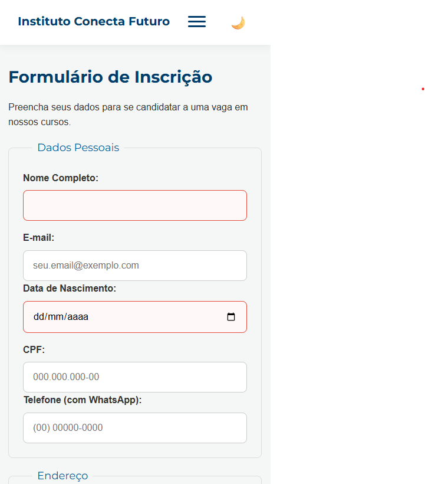
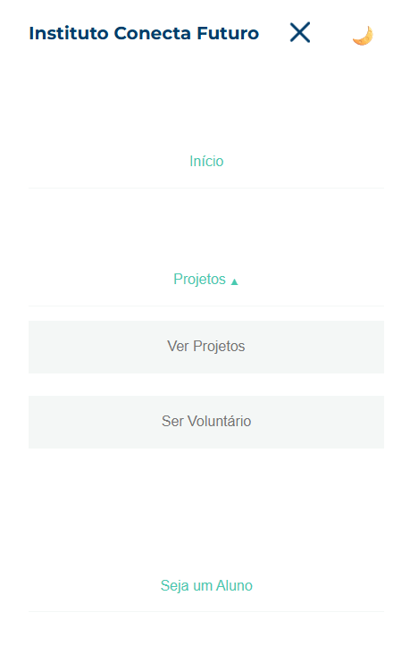
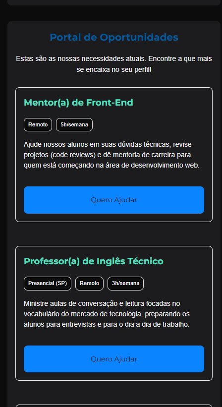
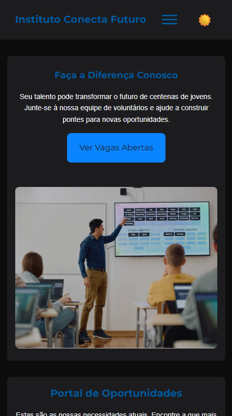

Plataforma Web para ONGs
Objetivo Geral

Este projeto consiste em uma plataforma web desenvolvida para Organizações Não Governamentais (ONGs), com o objetivo de facilitar o gerenciamento de atividades, a divulgação de projetos e a captação de voluntários e recursos. O sistema foi desenvolvido como parte da disciplina de Desenvolvimento Front-End da Universidade Cruzeiro do Sul.

Estrutura do Projeto
-----------------------------------------------------------------------------------------

Entrega I – Fundamentos e Estruturação

Objetivo:
Aplicar os fundamentos de HTML5 para construir a base estrutural da plataforma, definindo as seções principais do site, hierarquia de conteúdo e navegação inicial.

Principais pontos:

Estrutura semântica em HTML5

Organização do conteúdo (home, projetos, sobre, contato, etc.)

Preparação para integração com as etapas seguintes
-----------------------------------------------------------------------------------------

Entrega II – Estilização e Leiautes

Objetivo:
Aplicar CSS3 para transformar a estrutura HTML em uma interface visual moderna, responsiva e acessível, seguindo boas práticas de design e usabilidade.

Principais pontos:

Criação de leiaute responsivo (mobile first)

Uso de variáveis, seletores e pseudo-classes

Implementação de estilos coerentes e identidade visual da ONG
-----------------------------------------------------------------------------------------

Entrega III – Interatividade e Funcionalidades

Objetivo:
Implementar JavaScript avançado para tornar a aplicação dinâmica e interativa, permitindo que o usuário interaja com a plataforma de forma fluida e intuitiva.

Principais pontos:

Manipulação do DOM

Implementação de eventos e validações de formulários

Criação de componentes interativos (menu dinâmico, carrosséis, filtros, etc.)
-----------------------------------------------------------------------------------------

Entrega IV – Versionamento, Acessibilidade e Deploy

Objetivo:
Consolidar o projeto aplicando práticas de versionamento profissional, acessibilidade digital e deploy em ambiente de produção.

Principais pontos:

Uso do Git e GitHub para versionamento de código

Aplicação de boas práticas de acessibilidade (WCAG)

Publicação da plataforma em ambiente online (GitHub Pages ou servidor externo)

Tecnologias Utilizadas

HTML5

CSS3

JavaScript (ES6+)

Git / GitHub
-----------------------------------------------------------------------------------------
Autor

Nome: Vinícius Agostin
Disciplina: Desenvolvimento Front-End
Instituição: Universidade Cruzeiro do Sul

## Pré-visualização

